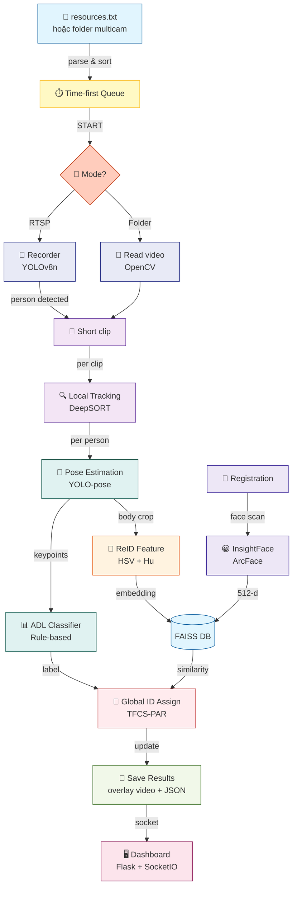

```
- cài build-tools do có insightface
https://visualstudio.microsoft.com/visual-cpp-build-tools/

- cài python 3.11
py -3.11 -m venv .venv
.venv\Scripts\activate
python -m pip install --upgrade pip setuptools wheel
pip install cython

- cài các gói FE
pnpm install
pnpm add socket.io-client
pnpm add -D tailwindcss postcss autoprefixer
pnpm exec tailwindcss -i ./static/tailwind.input.css -o ./static/tailwind.css --minify


- cài các gói CV
pip install torch torchvision --index-url https://download.pytorch.org/whl/cpu
pip install -r requirements.txt
```

```
Capstone_Project/
├── cpose/                          # THƯ VIỆN AI LÕI (Model-level wrappers, không dính tới Web)
│   ├── core/                       # Các module xử lý AI cấp thấp
│   │   ├── detection/              # Detector wrappers cho YOLO/RTDETR
│   │   │   ├── base.py             # Interface BaseDetector định nghĩa hàm detect()
│   │   │   ├── yolo_ultra.py       # Wrapper cho Ultralytics YOLO nhận diện người
│   │   │   └── factory.py          # Hàm build_detector() khởi tạo theo cấu hình
│   │   ├── pose_estimation/        # Module ước lượng khung xương
│   │   │   ├── base.py             # Interface BasePoseEstimator định nghĩa hàm estimate()
│   │   │   ├── yolo_pose.py        # Wrapper cho YOLO-Pose trích xuất 17 điểm khớp
│   │   │   ├── rtmpose.py          # Wrapper cho RTMPose (tùy chọn hiệu năng cao)
│   │   │   └── factory.py          # Hàm build_pose_estimator() khởi tạo bộ ước lượng
│   │   ├── face/                   # Module nhận diện khuôn mặt (ArcFace, SFace)
│   │   │   ├── base.py             # Interface BaseFaceRecognizer (encode/compare)
│   │   │   ├── insightface_arcface.py # Trích xuất 512-d embedding dùng ArcFace
│   │   │   └── factory.py          # Hàm build_face_recognizer() khởi tạo bộ nhận diện
│   │   ├── reid/                   # Module nhận dạng lại người (Body feature)
│   │   │   ├── base.py             # Interface BaseReIDModel định nghĩa hàm encode_body()
│   │   │   └── simple_body_reid.py # ReID dựa trên màu sắc và hình dáng cơ thể
│   │   └── vectordb/               # Tầng trừu tượng hóa cơ sở dữ liệu Vector
│   │       ├── base.py             # Interface BaseVectorDB (add/search/remove)
│   │       ├── faiss_db.py         # Backend FAISS hỗ trợ tìm kiếm láng giềng gần nhất
│   │       └── factory.py          # Hàm build_vectordb() khởi tạo backend (CPU/GPU)
│   ├── io/                         # Công cụ hỗ trợ Input/Output video chuyên dụng
│   │   ├── video_reader.py         # Đọc video hiệu năng cao dưới dạng generator
│   │   ├── camera_stream.py        # Quản lý luồng RTSP/Webcam với tự động kết nối lại
│   │   └── sink_writer.py          # Ghi frame kèm overlay (xương, nhãn) ra file video
│   ├── pipeline/                   # Các luồng tích hợp sẵn (Phase 1, 2, 3)
│   │   ├── multicam_recorder.py    # Phase 1: Nhận diện và cắt clip tự động
│   │   ├── multicam_analyzer.py    # Phase 2: Chạy Pose/Detection offline sinh file label
│   │   └── multicam_recognizer.py  # Phase 3: Tích hợp Pose+ADL+ReID cho multicam demo
│   └── utils/                      # Các tiện ích toán học và xử lý logic thuần túy
│       ├── pose_ops.py             # Tính góc khớp, tư thế và vector đặc trưng ADL
│       ├── bbox_ops.py             # Xử lý hộp bao: IOU, NMS, lọc kích thước
│       └── timing.py               # Đo FPS và phân tích độ trễ của các module
├── app/                            # ỨNG DỤNG DASHBOARD (Product Layer)
│   ├── api/                        # Tầng giao tiếp HTTP & WebSocket
│   │   ├── routes.py               # REST Endpoints: /config, /pose, /registration...
│   │   └── ws_handlers.py          # Sự kiện Socket.IO: camera_status, pose_status...
│   ├── core/                       # Logic nghiệp vụ của sản phẩm
│   │   ├── global_id.py            # GlobalPersonTable: Ánh xạ ID xuyên camera
│   │   ├── reid_logic.py           # Logic ReID thực tế dùng vectordb và cpose.core.reid
│   │   └── tracking.py             # Bộ theo dấu cục bộ (Local Tracker) trong từng clip
│   ├── services/                   # Lớp dịch vụ bao bọc các pipeline của cpose
│   │   ├── recorder_service.py     # Điều phối Phase 1 và thông báo trạng thái qua Socket
│   │   ├── analyzer_service.py     # Quản lý hàng đợi công việc gán nhãn Phase 2
│   │   ├── recognizer_service.py   # Điều phối Phase 3 và tổng hợp kết quả Pose+ADL
│   │   └── registration_service.py # Quản lý quy trình đăng ký danh tính khuôn mặt
│   ├── storage/                    # Tầng lưu trữ dữ liệu bền vững
│   │   ├── vector_db.py            # Quản lý index FAISS và hồ sơ người dùng
│   │   └── persistence.py          # Lưu trữ metadata, mapping ID và đường dẫn embedding
│   ├── utils/                      # Tiện ích phục vụ riêng cho ứng dụng web
│   │   ├── pose_utils.py           # Áp dụng các quy tắc ADL trả về nhãn hành động
│   │   ├── file_handler.py         # Quản lý file hệ thống và danh sách resources.txt
│   │   ├── stream_probe.py         # Kiểm tra thông tin luồng RTSP (FPS, Resolution)
│   │   └── runtime_config.py       # Tải và xác thực cấu hình config.yaml bằng Pydantic
│   └── bootstrap/                  # Khởi tạo ứng dụng Flask/SocketIO
│       ├── app_factory.py          # Hàm create_app() cấu hình server và đăng ký routes
│       └── config_loader.py        # Kiểm tra và tải cấu hình từ file YAML
├── research/                       # MÔI TRƯỜNG NGHIÊN CỨU (FastAPI Research Server)
│   ├── api/                        # Endpoint điều khiển thực nghiệm (Experiment Control)
│   │   ├── routes_experiments.py   # Quản lý trạng thái và kết quả các lần chạy thử
│   │   └── ws_experiments.py       # Stream tiến độ thực nghiệm thời gian thực
│   ├── services/                   # Logic xử lý nghiên cứu
│   │   ├── experiment_runner.py    # Thực thi các pipeline thử nghiệm trên tập dữ liệu
│   │   ├── model_registry.py       # Quản lý danh sách các mô hình đang thử nghiệm
│   │   └── benchmark_service.py    # Tính toán các chỉ số mAP, Accuracy, FPS...
│   └── schemas/                    # Định nghĩa cấu trúc dữ liệu Pydantic cho Research
├── shared/                         # THÀNH PHẦN CHIA SẺ (Dùng chung cho App & Research)
│   ├── io/                         # Quản lý đường dẫn và tệp tin tập trung
│   │   ├── paths.py                # Single source of truth cho mọi thư mục data/model
│   │   └── job_store.py            # Quản lý vòng đời trạng thái của các tác vụ AI
│   ├── contracts/                  # Định nghĩa các bản giao kèo dữ liệu (TypedDict)
│   └── adapters/                   # Lớp chuyển đổi giao tiếp giữa Flask và FastAPI
├── data/                           # KHO DỮ LIỆU (Video, Labels, Results)
│   ├── config/resources.txt        # Danh sách nguồn camera đầu vào
│   ├── multicam/                   # Dữ liệu video cho demo đa camera
│   ├── raw_videos/                 # Clip thô thu thập từ Phase 1
│   ├── output_labels/              # File nhãn JSON sinh ra từ Phase 2
│   ├── output_pose/                # Kết quả video và JSON từ Phase 3
│   └── research_runs/              # Nhật ký và kết quả các lần chạy nghiên cứu
|-- models/                         # Core AI models (Product & Research)
|-- static/                         # UI assets (HTML/JS/CSS + Tailwind build)
|   |-- index.html                  # Main dashboard UI for Flask/SocketIO
|   |-- tailwind.input.css          # Tailwind input used to build local CSS
|   `-- tailwind.css                # Built CSS used by the dashboard at runtime
|-- main.py                         # Flask dashboard entry point
|-- package.json                    # Frontend scripts and Node.js dependencies
|-- package-lock.json               # Locked Node.js dependency versions
|-- requirements.txt                # Python dependencies to install
|-- resources.txt                   # Camera source list for multicam/RTSP
|-- run-product.bat                 # Start product dashboard and build CSS
|-- run-push-git.bat                # Commit and push code to GitHub
|-- run-research.bat                # Start the research environment
|-- AGENTS.md                       # Mandatory AI assistant rules for the project
|-- PIPELINE.md                     # Documentation for the 3-stage pipeline
|-- TFCS-PAR.md                     # Cross-camera tracking technical spec
`-- README.md                       # General usage documentation

```

## System Architecture


